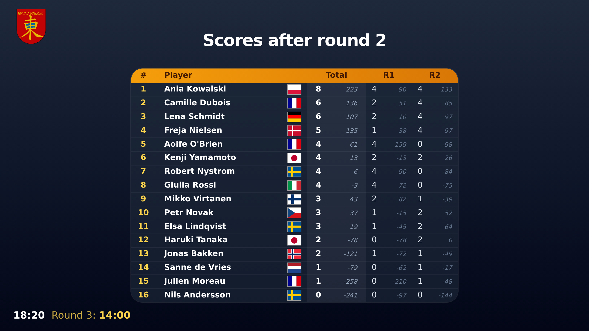

# Mahj.OVH, Mahjong Organizer Virtual Hub

One app to run a mahjong tournament. It handles the player list, the seating,
the scores, the screens in the room, the results for spectators, and the
official EMA report. It works with MCR and Riichi rules.

## What it does

- **Players and seating.** Import the players, the teams and the seating plan
  from a spreadsheet. You can also randomize the seating, or run the team draw
  live on screen.
- **Scoring.** Enter the scores table by table. The app checks them. You can also
  take a photo of a score sheet and let AI read it.
- **Screens in the room.** A round timer with a countdown and a gong. Standings
  that rotate between views. The schedule, announcements, and a prize-giving
  ceremony that shows the podium from 10th place to 1st.
- **Results for spectators.** A public score table with tournament statistics.
  Click a player, a team or a table to see the details.
- **Publishing.** The app uploads the results website to any cheap web host over
  SFTP. Spectators read a normal website, and your laptop stays off the internet.
  The address goes on the screens as a QR code, and on the printed player cards.
- **Reports.** The official EMA report as an Excel file, in one click. Also a
  statistics file per player.
- **Roles.** One person is the tournament admin. Volunteers get only what they
  need: Scorer, Display operator or Publisher. Access is given per tournament, so
  an account from one event cannot see another.

## Run it

**On [mahj.ovh](https://mahj.ovh), hosted by us.** Nothing to install. Open an
issue on this repository to ask for a subdomain for your event, like
`mytournament.mahj.ovh`.

**Locally, on a laptop.** One tournament, no server, no domain name and no
Docker. Scores are entered by hand, with no photo scanning. See
[docs/hosting/standalone.md](docs/hosting/standalone.md).

**On your own server.** Several tournaments, each on its own subdomain. You need
a host with Docker, a domain name and a wildcard TLS certificate. See
[docs/hosting/deployment.md](docs/hosting/deployment.md).

It is the same app in all three cases.

## Documentation

The documentation is in [docs/](docs/README.md). On tournament day, read the
[crew guide](docs/admin-console/guide.md).

## Development

- **Django 5.2** on ASGI, with **Channels** for the live screens.
- **PostgreSQL** through **PgBouncer**, and **Redis**, on the server. Plain
  **sqlite** and no Redis on the laptop.
- **Alpine.js** and **Tailwind CSS** in the browser.
- **Docker Compose** runs the server. **PyInstaller** builds the laptop app, one
  binary per operating system.

[docs/dev/development.md](docs/dev/development.md) is the developer setup.

## Use of AI

This code base was originally written without AI. Claude Code was used later
to rework the styling of the app and to make the code more secure and more
robust.

## License

[MIT](LICENSE) © 2018-2026 Christophe Avenel.

This application is not affiliated with the European Mahjong Association.
