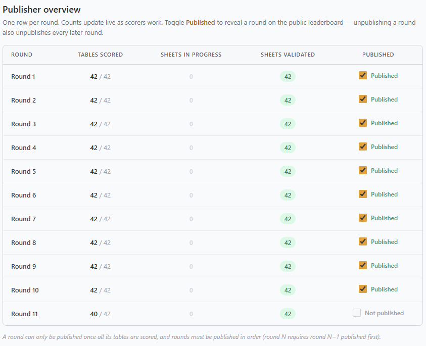

# Admin console — head scorer guide (Riichi)

**Mahj.OVH** (Mahjong Organizer Virtual Hub) is an all-in-one toolbox for running
a Mahjong tournament: entering scores, publishing the leaderboard, driving the
projector/TV screens, and running the prize-giving ceremony.

This guide is for a **head scorer** on a **Riichi** tournament — someone holding
all three non-staff roles: **Scorer**, **Publisher** and **Display operator**. It
is written to be **read in order**, following the timeline of an event: sign in,
enter scores, publish rounds, drive the screens, run the ceremony.

## How to use this guide

Each section is marked with a **role callout** telling you which of your roles it
needs:

> 🔑 **Who can do this:** *Publishers.*

A head scorer holding all three roles can do every action below. **Roles combine**,
so if some of your crew hold only one role, hand them the matching section.

---

## 1. Accessing the console

Every tournament lives on its own **subdomain**:

```
https://<tenant>.mahj.ovh/
```

For example `https://oemc2026.mahj.ovh/` for a real event, or
`https://test.mahj.ovh/` for the test tenant (see [§9](#9-rehearsing-on-the-test-tenant)).

| URL | What it is |
|---|---|
| `https://<tenant>.mahj.ovh/` | The **public desktop** view (live standings, seating, stats). No login. |
| `https://<tenant>.mahj.ovh/admin` | The **admin console** (this guide). Requires login. |
| `https://<tenant>.mahj.ovh/<n>` | A **display screen** (projector output), e.g. `/1`, `/2`. |

### Logging in

Open `https://<tenant>.mahj.ovh/admin`. If you are not signed in you are sent to
the login page; enter your username and password. You then land on your role's
default page.

> <br>
> 📸 **Screenshot — login page.**

To **log out**, use the avatar menu in the top-right corner → *Log out* (or visit
`/admin?logout=1`). The avatar menu also shows the signed-in username.

> Need an account, or a role added/changed? Ask a **staff organizer** — they
> create users and assign the `Scorer` / `Publisher` / `Display_op` groups.

---

## 2. Getting around the console

The console is a single shell with a **left sidebar** (sections) and a **top bar**
(page title + avatar menu). On mobile the sidebar collapses behind the ☰ button.

The sidebar only shows the sections **your role can use**:

```
┌─ DURING TOURNAMENT
│  ├─ Scoring                      (scorer, publisher)
│  ├─ Display on screens           (display_op)
│  ├─ Ceremony console             (display_op)
│  └─ To print ▸  (scores)         (display_op)
└─
```

> <br>
> 📸 **Screenshot — sidebar as seen by a scorer (Scoring only).**

### The "To print" modal

Print actions open an in-app modal containing an `<iframe>` of the printable page,
with **Close** and **Print** buttons. *Print* sends the iframe to the browser's
print dialog (use "Save as PDF" to export).

> <br>
> 📸 **Screenshot — a print preview modal.**

### Riichi scoring (Minipoints only)

This is a **Riichi** tournament, so scoring is just the per-player **Minipoints
(MP)** — there is no Table Points column and no per-hand score sheet. (On an MCR
tournament there's an extra TP column and a 16-hand score sheet that can be scanned
— see [MCR_head_scorer.md](MCR_head_scorer.md).)

### Live updates

The console and screens stay in sync over WebSockets — you rarely need to refresh:

- **Scoring pages** sync each other cell-by-cell as scores are typed, and reflect
  publish-state changes live.
- **Display screens** react instantly to screen-view changes, timer start/stop,
  display-setting changes, and ceremony steps.
- **The public site** refreshes only when a round is **published/unpublished** (so
  the crowd never sees scores before they're official).

If a screen ever looks stuck, just refresh that browser tab — it rejoins at the
current state.

---

## 3. During the tournament — entering scores

> 🔑 **Who can do this:** *Scorers.* A **scorer** enters and corrects each table's
> per-player Minipoints.

### The Scoring page

Open **Scoring** from the sidebar (or just sign in as a scorer/publisher). The
page shows one **tab per round**; click a tab to switch rounds.

> <br>
> 📸 **Screenshot — Scoring page: round tabs + table grid for the active round.**
>
> *(The screenshot is from an MCR event; on Riichi the layout is the same minus
> the Table Points column and the Score sheet button.)*

Each round is a grid with **one row per table**:

| Column | Meaning |
|---|---|
| ● (status pip) | Per-row save/validity indicator (see below) |
| **Table N** | Table number |
| **East / South / West / North** | The four seats: player name + Minipoints input |
| **Sum** | Sum of the four Minipoints — must equal **0** |

### Entering a table's scores

For each seat you type the player's **Minipoints (MP)** in the input. (Riichi has
no Table Points, so there's just the one box per seat.)

As soon as all four seats are filled:

- The **Sum** cell turns **green (`0`)** if the four MP add up to zero (a valid
  table), or **red** showing the non-zero total if they don't.
- The row's **status pip** turns amber ("pending, not yet saved") then green once
  the save lands.

> **⚠ IMPORTANT — a non-zero Sum is expected when a game has penalties.** If one
> or more penalties were applied during a game, the four Minipoints will **not**
> add up to 0: the **Sum** stays red and shows the penalty total (e.g. `-10`,
> `-20`). **This is not an error** — leave it. The MP you enter (with the penalty
> already applied) are the official scores; just confirm the red Sum matches the
> total of the penalties applied.

Scores **save automatically**. There is no "Save" button.

> <br>
> 📸 **Screenshot — a filled table row: green sum, four seats filled.**

#### Status pip colours

| Pip | Meaning |
|---|---|
| ⚪ grey | Row incomplete / not started |
| 🟡 amber | Edited, save pending (debounced) |
| 🟢 green | Saved successfully |
| 🔴 red | Save failed (e.g. network error, or the round is locked) |

#### Live collaboration

Multiple scorers can work the same round at once. Edits made by another scorer
appear in your grid within a second (rows you are *actively* editing are not
overwritten for a few seconds, so you won't lose your in-progress typing).

#### Finding a table

A **Filter by table** box sits just above the grid. Type a table number to show
only that table (exact match); clear it to show every table again. The value
carries across round tabs, so the filter sticks when you switch rounds. Press
<kbd>/</kbd> anywhere on the page (even from a score input) to jump to it, and
**Tab** off the last seat loops back to the filter.

---

## 4. During the tournament — publishing rounds

> 🔑 **Who can do this:** *Publishers.* A **publisher** decides **when each round
> becomes official** — i.e. visible on the public website and the leaderboard
> screens. Publishing is deliberately a separate role from scoring: scorers keep
> correcting numbers privately, and only a publisher flips a round to "public".

Publishers work on the same **Scoring** page as scorers (one tab per round). At
the top of each round's pane is a **publish bar**:

> <br>
> 📸 **Screenshot — publish bar on a round (toggle, status, hints).**

- **Publish round N** — the checkbox that publishes/unpublishes the round.
- **Status** — *Published* (green) or *Not published*, on the right.
- Hints appear contextually: *"unpublish to edit scores"* when a round is locked,
  and a special note on the **last round** (see below).

> For accounts without the `Publisher` role this toggle is **disabled** and
> labelled *"— staff or publisher only"*.

### Publishing a round

Tick **Publish round N**. The console enforces these rules (the same checks run on
the server, so they can't be bypassed):

1. **The round must be complete.** Every seat at every table in the round must have
   its Minipoints filled. If any are missing, the toggle stays disabled until the
   round is finished.
2. **Rounds publish in order.** You can't publish round N until rounds 1…N-1 are
   already published — no gaps. (Trying to do so is rejected with an explanatory
   error.)

On success:

- The round's scores become **locked** — score inputs in that round's grid turn
  grey/read-only. Scorers can no longer edit it. (This is the safety property:
  publishing freezes the official numbers.)
- The **public leaderboard updates** and all display screens refresh to show the
  newly official standings.

> <br>
> 📸 **Screenshot — a published (locked) round: green "Published", grey inputs.**

### Unpublishing a round

To correct a score after publishing, **untick Publish round N**. Because rounds
must stay gap-free, **unpublishing a round also unpublishes every round after it.**

Example: if rounds 1–5 are published and you unpublish round 3, rounds 3, 4 and 5
all become unpublished (and editable again); rounds 1 and 2 stay published.

After unpublishing, the round's inputs unlock and a scorer can fix the numbers;
re-publish when corrected.

### The last round is special (podium suspense)

Publishing the **final round** does **not** reveal the final standings to the
public. Instead it publishes the round with the result **hidden**, preserving
suspense for the prize-giving.

The publish bar reminds you of this on the last round:

> *"(last round: publishing keeps the final standings hidden — run the reveal from
> the Prize-giving console on the Ceremony admin page)"*

So the end-of-event flow is:

1. Publish the final round normally (standings stay hidden).
2. Run the **Ceremony console** (see [§6](#6-the-prize-giving-ceremony)) to reveal
   teams/players place by place, and finally press **Publish to everyone & end** —
   *that* is what makes the complete final results public.

> <br>
> 📸 **Screenshot — last-round publish bar with the ceremony hint.**

### Live sync

Publish state is shared live across all open Scoring pages: if another publisher
(or you, on another device) publishes a round, every scorer's grid updates its
toggles, status labels, and lock state within a second.

### Publisher overview

Alongside the per-round publish bars, publishers (and staff) get a dedicated
**Publisher overview** page in the sidebar (under *During tournament*). It gives a
bird's-eye view of the whole tournament — **one row per round** — so you can see
how far each round has progressed and publish without hunting through the round
tabs:

> <br>
> 📸 **Screenshot — Publisher overview: one row per round with progress counts and a Published toggle.**

| Column | Meaning |
|---|---|
| **Tables scored** | Tables whose four seats all have Minipoints entered, shown as `scored / total`. |
| **Sheets in progress** / **Sheets validated** | Per-table score-sheet progress. Score sheets are an **MCR** feature — under Riichi there are none, so these two columns stay at zero. |
| **Published** | A checkbox to publish / unpublish the round. |

The **Published** checkbox obeys the same rules as the publish bar: a round can
only be ticked once **all** its tables are scored, and rounds publish **in order**
(round N needs round N-1 first), so an incomplete or out-of-order round's checkbox
stays disabled.

**Unpublishing pops up a big warning** before anything happens — since
unpublishing a round also unpublishes every later round (no gaps), the
confirmation spells out exactly which rounds will be reopened.

Everything on this page **updates live**: as scorers fill rows the counts move on
their own; and publishing/unpublishing here immediately updates the Scoring page,
the public leaderboard and the display screens — exactly as the publish bar does
(and vice-versa).

---

## 5. During the tournament — driving the screens

> 🔑 **Who can do this:** *Display operators.* A **display operator** drives
> everything the audience sees on the room's **projectors / TV screens**: which
> view each screen shows, the **round timer** (with synchronized start gong), the
> display settings (zoom, message, round length), and the **prize-giving
> ceremony** (see [§6](#6-the-prize-giving-ceremony)).
>
> Display operators use these sidebar items: **Display on screens**, **Ceremony
> console**, and **To print → Scores**.

### Screens, explained

Each physical screen in the room runs a browser pointed at a numbered URL:

```
https://<tenant>.mahj.ovh/1     ← screen 1
https://<tenant>.mahj.ovh/2     ← screen 2
...
```

A **screen** record in the app maps each of these URLs to a **view** (what to
show). You add as many screen records as you have physical displays, point each
display's browser at the matching `/<n>` URL, and then change views centrally from
the console — every screen reacts live.

**Available screen views:**

| View | Shows |
|---|---|
| `black` | Blank black screen (off) |
| `scores p. 1` | Leaderboard, page 1 |
| `scores p. 2` | Leaderboard, page 2 |
| `scores all` | Full leaderboard (all players) |
| `scores all, total only` | Compact totals-only leaderboard (3 columns) |
| `counter` | The **round timer** + a condensed standings strip |
| `schedule` | The tournament schedule |

### Display on screens page

Open **Display on screens** from the sidebar.

> <br>
> 📸 **Screenshot — Display on screens page (screen cards + settings).**

**Adding / removing screens:**

- **Add screen** — appends a new screen (starts on `black`).
- **Remove screen** — removes the **last** screen.

Add one screen per physical display, then open each display's browser at its
`/<n>` URL (shown on the screen card as a clickable link).

**Setting what each screen shows:**

Each screen card has a **Current output** dropdown — pick a view and it changes on
that physical screen **immediately**. The card also shows the screen's public URL
(`https://<tenant>.mahj.ovh/<n>`) so you can open it on the projector machine.

> <br>
> 📸 **Screenshot — a screen card: URL link + "Current output" dropdown.**

**Display modes (saved presets):**

A **display mode** is a saved snapshot of *all* screens' current views, so you can
flip the whole room between layouts in one click.

- **Save screen configuration as a display mode** — type a name and **Save mode**
  to capture the current views of every screen.
- Saved modes appear as amber tiles. **Click a tile** to apply that mode to all
  screens; click the small **✕** on a tile to delete it.

Modes can also be switched from the mobile companion app.

> <br>
> 📸 **Screenshot — saved display-mode tiles.**

**Screen previews:**

Click **Show preview** to load live thumbnails of every screen (scaled-down
1920×1080 iframes), so you can confirm what's actually on each projector without
walking over to it. Click the **enlarge** icon on a thumbnail to view it full-size
in a modal. Previews are only loaded while shown (to save bandwidth).

> <br>
> 📸 **Screenshot — the screen previews row.**

### Round timer control

The **Timer control** panel runs the per-round countdown shown on any screen set
to the `counter` view.

> <br>
> 📸 **Screenshot — Timer control panel (Start / Running / Reset).**

- **Start timer** — starts the round. There's a brief lead-in and a **3-2-1
  countdown with a start gong** that fires in lockstep on **every** screen, so all
  rooms begin together.
- While running, the panel shows the **time remaining** and a *Running* badge; the
  button becomes **Reset timer**.
- When time is up the badge reads *Done*; **Reset timer** clears it back to
  stopped.
- Resetting a running timer asks for confirmation.

### Display settings

The **Display settings** panel holds presentation values. Each field
saves on change and pushes to the screens live.

> <br>
> 📸 **Screenshot — Display settings (zoom, score lines, message, total time).**

| Setting | Effect |
|---|---|
| **Screen zoom** (1 = 100%) | Scales the on-screen content up/down to fit your displays |
| **Number of score lines per screen** | How many leaderboard rows fit on one screen page (drives pagination of `scores p. 1/2`) |
| **Counter message** | The "welcome"/message text shown under the timer on the `counter` view |
| **Total time of a round (seconds)** | Round length the timer counts down from (e.g. `6900` = 1 h 55 m) |

### To print → Scores

Under *During tournament → To print*, **Scores** opens a printable full
leaderboard in the print modal (Close / Print). Handy for posting paper standings
between rounds.

---

## 6. The prize-giving ceremony

> 🔑 **Who can do this:** *Display operators.*

The **Ceremony console** takes over **all** display screens with a full-screen
reveal sequence for the awards, while the **public website stays in suspense** until
you publish at the very end.

Open **Ceremony console** from the sidebar.

> <br>
> 📸 **Screenshot — Ceremony console (Teams / Players / Stats panels).**

### Layout

**Top-right buttons** (apply to the whole ceremony):

| Button | Effect |
|---|---|
| **Show intro slide** | A "Prize-giving ceremony" holding slide (logo + title) on every screen |
| **End — back to screens** | Stop the ceremony; screens return to their normal views. **Nothing is published.** |
| **Publish to everyone & end** | Reveal the **full final results** on the public site and all screens, then end. **Do this once, at the very end.** |

The rest of the console:

- **On screens now** — a live status line telling you what the audience currently
  sees.
- **Screen previews** — same live previews as the Display page, so you can watch
  the reveal land.
- Three result panels: **Teams (top 3)**, **Players (top N)**, and **Stat
  highlights**.

### Teams and Players panels

Each has the same controls:

- **Start** — put that section on the screens, empty and ready.
- **Reveal next ▸** — reveal the next place (lowest rank first, working up to 1st).
  Press once per place.
- **◂ Back** — undo the last reveal.

A yellow **"Next to announce"** line always previews the upcoming place, name, and
score — read it to the announcer *before* you press *Reveal next*. The full list is
shown below for reference, greying out places not yet revealed.

- **Teams** shows only the **top 3** (the prize-winners), each with team name, all
  member names, and the team total (Minipoints) — no individual player scores.
- **Players** shows the **top N** (typically 16), each with their Minipoints total.

> Teams panel only appears if the tournament uses teams.

### Stat highlights

Click any **stat card** (e.g. *Highest score in a round*, *Biggest hand*, *Most
wins*) to show it big on the screens. You can show any number of them, in any
order, or skip them entirely.

### Typical run-through

1. **Show intro slide** while people gather.
2. **Teams → Start**, then **Reveal next** ×3 (3rd → 1st). Hand out team prizes.
3. **Players → Start**, then **Reveal next** until 1st.
4. Optionally show a few **Stat highlights**.
5. **Publish to everyone & end** — results are now public for everyone.

> The "Publish to everyone & end" step is how the **final standings** become
> public: during play the last round is published with its result hidden for
> suspense, and this reveal is the first time complete results leave the building
> (it also pushes the final standings to any configured webhook).

### If a screen looks stuck

Each screen recovers on its own after a moment. If one stays blank or stale,
**refresh that screen's browser tab** — it rejoins at the current slide. The
console itself can be reloaded too; it resumes where you left off.

---

## 7. Permissions recap

| Action | Scorer | Publisher | Display op |
|---|:--:|:--:|:--:|
| Enter / edit scores | ✅ |  |  |
| Publish / unpublish rounds |  | ✅ |  |
| Manage screens, timer, display settings |  |  | ✅ |
| Run the ceremony / final "publish to everyone" |  |  | ✅ |

(Roles combine: a head scorer in all three groups has the union of these.)

---

## 8. Quick reference

| Task | Where | Role |
|---|---|---|
| Enter table MP | Scoring page → seat inputs (auto-saves) | Scorer |
| Check a table is valid | The **Sum** cell reads green **0** | Scorer |
| Make round N official | Scoring → round N → tick **Publish round N** (round complete; 1…N-1 published) | Publisher |
| Reopen a round for edits | Untick **Publish round N** (also reopens N+1…) | Publisher |
| Final round | Publish it (stays hidden) → finish via Ceremony console | Publisher + Display op |
| Add a projector | Display page → **Add screen**, open `/<n>` on that machine | Display op |
| Change what a screen shows | Screen card → **Current output** dropdown | Display op |
| Flip the whole room at once | Save a **display mode**, click its tile | Display op |
| Check screens remotely | **Show preview** | Display op |
| Start the round (with gong) | Timer control → **Start timer** | Display op |
| Set round length | Display settings → **Total time of a round** | Display op |
| Run the awards | **Ceremony console** | Display op |
| Make final results public | Ceremony console → **Publish to everyone & end** | Display op |
| Rehearse with fake data | `test.mahj.ovh` → Scoring → **Fill all rounds — scores** | (see §9) |

---

## 9. Rehearsing on the test tenant

The **test tenant** is a throwaway tournament for rehearsing the whole system —
training scorers, checking how the leaderboard/screens look with data, and
practising the prize-giving ceremony — **without touching a real event**. It lives
at:

```
https://test.mahj.ovh/
```

Its subdomain is literally `test`. The only functional difference from a real
tenant is a **fake-data toolbar** on the Scoring page that can fill or clear *every
round at once* with random-but-valid results. Everything else (screens, ceremony,
publishing, printing) behaves exactly like production, so it's a faithful
rehearsal.

> The fake-data buttons fill **scores** for players and tables that already exist —
> they do **not** create players. So the test tenant must first be set up like a
> real event (players, seating, schedule, rules). That setup is the staff
> **Import from template** step — ask a **staff organizer** to run it before you
> rehearse.

> <br>
> 📸 **Screenshot — Import from template page.**

### The fake-data toolbar 🧪

On `test.mahj.ovh`, the **Scoring** page shows an extra dashed amber toolbar at the
top (it is rendered **only** when the subdomain is `test`):

> <br>
> 📸 **Screenshot — the "🧪 Test data" toolbar above the round tabs.**

| Button | What it does |
|---|---|
| **Fill all rounds — scores** | Fills the four seats of every table in **every round** with random Minipoints that sum to zero, and saves. If you're a publisher it then **publishes rounds in order** too. |
| **Clear all rounds — scores** | Clears all entered Minipoints (unpublishing first if needed). |

> On Riichi the *score sheets* fill/clear buttons aren't relevant — those generate
> the MCR per-hand data. The note *"some last-round scores are left empty on
> purpose"* is intentional: the tool leaves the **last two tables of the final
> round blank** so you can exercise the *incomplete-round / can't-publish* path and
> the podium-suspense flow.

**Publishing during fill:** If you run **Fill all rounds — scores** while signed in
as a **publisher** account, the tool also publishes every completed round (in
order) right after filling them — so the public leaderboard and screens light up
immediately. If you're a plain scorer it just fills the scores and leaves
publishing to a publisher.

> <br>
> 📸 **Screenshot — publisher round overview: every round published except the last, which still has 2 tables empty.**

### Rehearsing each part of the system

Once the test tenant has data you can exercise the full operator workflow:

1. **Leaderboard / public site** — open `https://test.mahj.ovh/` to see standings,
   seating, and stats render with the fake data.
2. **Screens** — as a display operator ([§5](#5-during-the-tournament--driving-the-screens)):
   add a screen, open `https://test.mahj.ovh/1`, and try each view (`scores all`,
   `counter`, `schedule`, …). Practise the **timer** and **display modes**.
3. **Publishing** — as a publisher ([§4](#4-during-the-tournament--publishing-rounds)):
   publish/unpublish rounds, see the lock behaviour and the cascade on unpublish.
4. **Ceremony** — as a display operator: run the **Ceremony console**
   ([§6](#6-the-prize-giving-ceremony)) end to end (Teams → Players → Stats →
   *Publish to everyone & end*). The deliberately incomplete last round lets you
   practise the suspense → reveal flow.
