# Admin console guide

**Mahj.OVH** (Mahjong Organizer Virtual Hub) is an all-in-one toolbox for running
a Mahjong tournament: importing players, entering scores, publishing the
leaderboard, driving the projector/TV screens, and running the prize-giving
ceremony.

This guide documents the **admin console** — the back-office web app the
tournament crew uses during an event. It is one document for every role,
organized in **parts, one per role**: read the part (or parts) matching what you
do, plus Part I, which everyone needs.

> 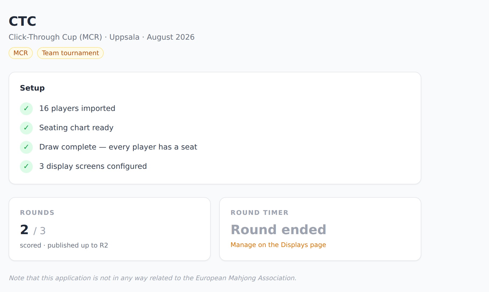<br>
> 📸 **Screenshot — Run dashboard:** live progress once the tournament is under way.

## Find your part

| You are… | Read |
|---|---|
| **Scorer** — enters table results | [Part I](#part-i-getting-in-and-around) + [Part II](#part-ii-scorer) |
| **Publisher** — makes rounds official | [Part I](#part-i-getting-in-and-around) + [Part III](#part-iii-publisher) |
| **Display operator** — screens, timer, ceremony | [Part I](#part-i-getting-in-and-around) + [Part IV](#part-iv-display-operator) |
| **Tournament admin** — sets up and oversees everything | The whole guide ([Part V](#part-v-tournament-admin) is yours alone) |
| **Head scorer** (scorer + publisher + display operator) | Parts I–IV. Printable one-page recaps: [scorer cheat sheet](MCR_scorer_cheat_sheet.md) and [head-scorer cheat sheet](MCR_head_scorer_cheat_sheet.md) (MCR) |

**Roles combine.** A person can hold several roles and can then do everything
each role allows. If a control described here is missing or greyed out for you,
your account lacks that role — ask a tournament admin
(see [User management](#16-user-management)).

**MCR vs Riichi.** The console adapts to the tournament's rule set (chosen in
the tournament settings):

- **MCR** (Mahjong Competition Rules): scoring uses **Table Points (TP)**
  derived from **Minipoints (MP)**, and every table has a **per-hand score
  sheet** (16 hands) that can also be **scanned** from paper.
- **Riichi** and others: only **Minipoints** are entered — no TP column, no
  score sheet, no scan tool. Sections that only apply to MCR are marked
  *(MCR only)*; on a Riichi event, skip them.

Most screenshots are from an MCR event; the Riichi layout is the same minus the
TP column and the *Score sheet* button.

## Roles at a glance

Access is **per tournament**: an account holds roles on this tournament only,
granted from the console's own [User management](#16-user-management) page.

| Role | What they do |
|---|---|
| **Scorer** | Enter & edit scores, fill/validate score sheets, use the scan tool |
| **Publisher** | Everything a scorer does, **plus** publish / unpublish rounds to the public leaderboard |
| **Display operator** | Manage screens, the round timer, display settings, and the ceremony console |
| **Admin** | All of the above, **plus** setup (settings, import, seating, players, printing), user management, web publishing, and the post-event EMA export |

Above tournament admins sits the **platform operator** (superuser) — the person
running the server, who creates tournaments and manages the database. Their
tools are summarized in [Part VI](#part-vi-platform-operator) and documented in
`docs/hosting/`.

After signing in, each role lands on the page it works from:

- **Admin** → the *Dashboard*.
- **Scorer** → the *Scoring* page (publishers too — the publish toggles live there).
- **Display operator** → the *Display on screens* page.

---

# Part I: Getting in and around

*For everyone.*

## 1. Accessing the console

Every tournament lives on its own **subdomain**:

```
https://<tenant>.<your-domain>/
```

| URL | What it is |
|---|---|
| `https://<tenant>.<your-domain>/` | The **public site** (live standings, seating, stats). No login. |
| `https://<tenant>.<your-domain>/admin` | The **admin console** (this guide). Requires login. |
| `https://<tenant>.<your-domain>/<n>` | A **display screen** (projector output), e.g. `/1`, `/2`. |

### Logging in

Open `https://<tenant>.<your-domain>/admin`. If you are not signed in you are
sent to the login page; enter your username and password — or use a **login
link** an admin sent you, which signs you in with no password at all. You then
land on your role's default page.

> 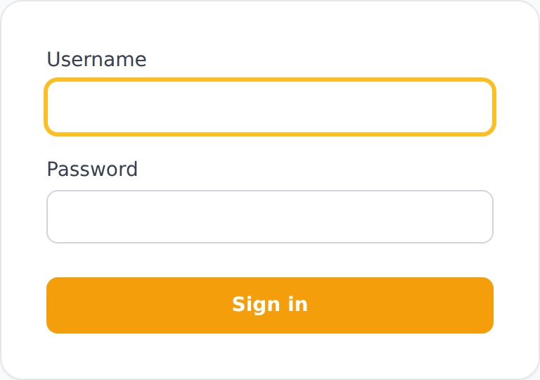<br>
> 📸 **Screenshot — login page.**

To **log out**, open the avatar menu in the bottom-left corner of the sidebar →
**Log out**. The same menu holds the **PDF editions of this guide** and the
cheat sheets.

> Need an account, a password reset, or a role added? Ask a **tournament
> admin** — they manage users from the console
> (see [User management](#16-user-management)).

## 2. Getting around the console

The console is a single shell with a **left sidebar** (pages) and a **top bar**
(page title + avatar menu). On mobile the sidebar collapses behind the ☰ button;
on desktop it can be collapsed to an icon rail.

The console is split into **two workspaces**, because a tournament has two very
different phases:

- **Setup** — everything you do *before* play: settings, players, seating, the
  draw, printing, accounts. Sky-blue accent.
- **Run** — everything you do *during* play: scoring, publishing, the screens,
  the ceremony, the exports. Amber accent.

Tournament admins switch between them with the **Setup / Run** toggle at the top
of the sidebar. Scorers, publishers and display operators only have Run — the
toggle isn't shown to them. Once a round has been scored or published (or the
round timer has been started), every Setup page carries a **"Tournament in
progress"** banner: nothing is blocked, but edits there now affect a live event.

The sidebar only shows the pages **your roles can use**.

**Setup** — tournament admins only. It opens on the **Setup checklist**, then
these groups:

| Group | Pages |
|---|---|
| Tournament | Tournament settings · Excel import / export |
| Players & seating | Edit players · Seating · Randomize players (live) ↗ · Team draw (live) ↗ |
| Print | Print materials · Player card design |
| Administration | User management · Backup & restore · Publish target |

**Run** — everyone's side. It opens on the **Dashboard**, which every role sees;
the rest depends on your roles:

| Group | Pages | Who sees it |
|---|---|---|
| Scoring | Scoring | admin, scorer, publisher |
| | Publisher overview | admin, publisher |
| Displays | Display on screens · Ceremony console | admin, display operator |
| Results | Print scores | admin, scorer, publisher |
| | Generate EMA report ↗ | admin |

Pages marked ↗ open outside the console, in their own full-screen page.
(Platform operators see one more entry under *Administration* — **Tenants** —
see [Part VI](#part-vi-platform-operator).)

> 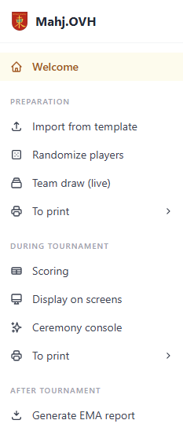<br>
> 📸 **Screenshot — the Setup sidebar as seen by an admin.**
>
> 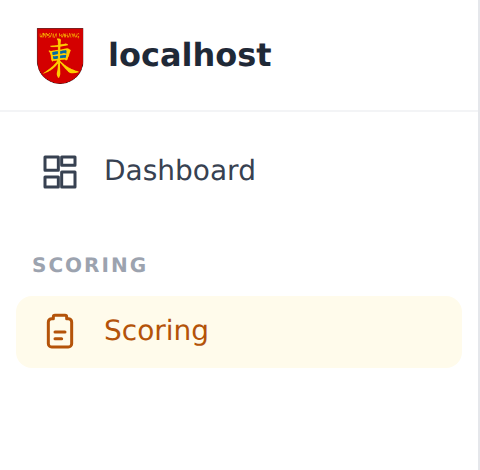<br>
> 📸 **Screenshot — sidebar as seen by a scorer (Run only).**

### Printing

Printable pages open in an in-app preview with **Close** and **Print** buttons —
*Print* sends it to the browser's print dialog (use "Save as PDF" to export).

- **Setup → Print materials** *(admins)*: one card per printout — player names,
  team names *(team events)*, player cards, table positions, cross positions
  (also by team), and the schedule — the paper the room needs before play. The
  page tells you whether the draw is complete, since cards and positions depend
  on draw numbers.
- **Setup → Player card design** *(admins)*: how the player cards look —
  see [Designing the player cards](#designing-the-player-cards).
- **Run → Results → Print scores** *(admins, scorers, publishers)*: the current
  standings, for posting paper results between rounds.

> 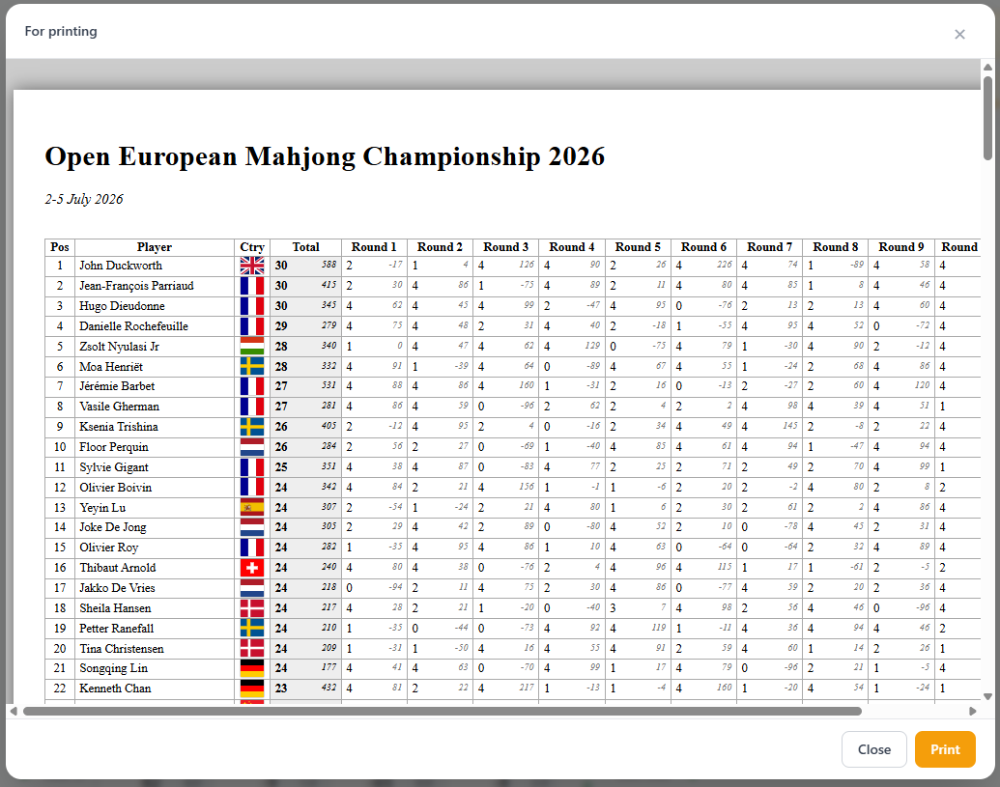<br>
> 📸 **Screenshot — a print preview (e.g. player cards).**

### Designing the player cards

**Setup → Player card design** *(admins)* controls how the printed player cards
look. Everything saves as you edit, and the preview beside the controls is the
real print page, so what you see is what comes out of the printer.

- **Card format** — **A6 portrait** (4 per A4 sheet) is the full-size card with a
  tall header. **A7 landscape** (8 per sheet) is half that, for short tournaments:
  a compact one-line header, and the period, session count and ruleset along the
  bottom edge where the A6 card carries them in its header. It holds eight rounds
  over one day, seven over two and six over three (each day adds a heading), and
  the page warns you above eight. The preview is the real check either way: rows
  that do not fit run off the bottom of the card there. Print **double-sided,
  flipping on the long edge**; the back of each sheet is laid out for that, so
  every card gets its own opponents on the back.

  Both formats keep a 7&nbsp;mm border clear on all four edges of the sheet, since
  few printers can print right to the paper edge, so a card comes out a little
  under a true A6 or A7 — 98&nbsp;×&nbsp;141.5&nbsp;mm and 98&nbsp;×&nbsp;70.75&nbsp;mm.
- **Theme** — *classic* (colour bars and filled seat chips), *minimal* (ink on
  paper, no colour bars) or *bold* (a filled header band that reads across a
  room). Switching theme replaces the colours below; if you have edited the CSS
  yourself, you are asked first.
- **Colours** — pick a preset palette, or set any colour individually. The
  controls are built from the stylesheet, so they always match what the card
  actually uses.
- **Advanced — edit the CSS** — the whole card stylesheet, if you want more than
  colours: hide a field, change a font, restyle the seat chips. Your CSS is added
  *after* the built-in one, so any rule you write wins, and the panel lists the
  class names to target. Cards may not load anything from another site, so
  `@import` and remote `url()` are rejected with a message; embed images as
  `data:` URIs instead.

The tournament logo and the spectator URL printed on the cards come from
**Tournament settings**, not this page.

> 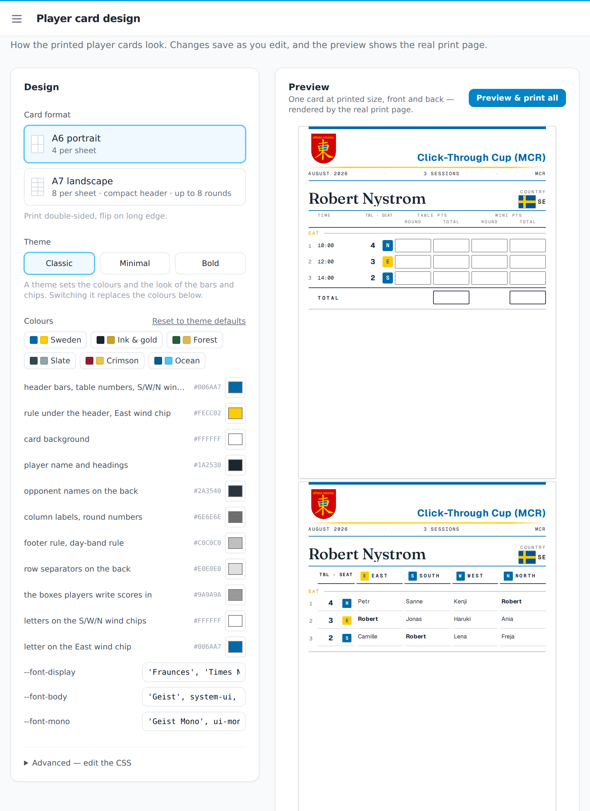<br>
> 📸 **Screenshot — Player card design: the controls, and the live preview of the
> card's front and back beside them.**

### Live updates

The console and screens stay in sync over WebSockets — you rarely need to
refresh:

- **Scoring pages** sync each other cell-by-cell as scores are typed, and
  reflect publish/validation state changes live.
- **Display screens** react instantly to screen-view changes, timer start/stop,
  display-setting changes, and ceremony steps.
- **The public site** refreshes only when a round is **published/unpublished**
  (so the crowd never sees scores before they're official).

If a page ever looks stuck, refresh that browser tab — it rejoins at the
current state.

---

# Part II: Scorer

*Entering and correcting table results; on MCR also the per-hand score sheets
and the phone scan tool.*

## 3. The Scoring page

Open **Scoring** from the sidebar (or just sign in as a scorer). The page shows
one **tab per round**; click a tab to switch rounds.

> 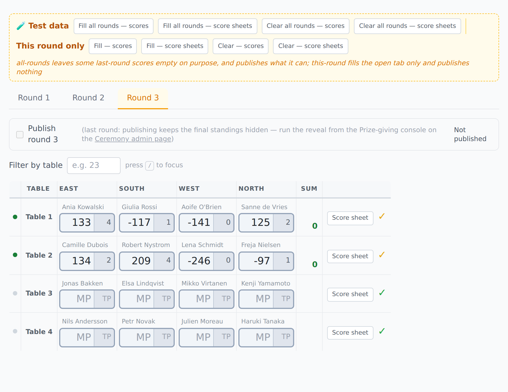<br>
> 📸 **Screenshot — Scoring page: round tabs + table grid for the active round.**

Each round is a grid with **one row per table**:

| Column | Meaning |
|---|---|
| ● (status pip) | Per-row save/validity indicator (see below) |
| **Table N** | Table number |
| **East / South / West / North** | The four seats: player name + score input(s) |
| **Sum** | Sum of the four Minipoints — must equal **0** |
| *(MCR only)* **Score sheet** | Opens the per-hand entry sheet, plus a ✓ validation badge |

## 4. Entering a table's scores

For each seat, type the player's **Minipoints (MP)** in the large input.

- **MCR:** the smaller **Table Points (TP)** box next to it is **read-only** —
  the console computes it automatically (4 / 2 / 1 / 0 points by rank,
  splitting ties by averaging).
- **Riichi / other rules:** only the MP box is shown; there is no TP.

As soon as all four seats are filled:

- The **Sum** cell turns **green (`0`)** if the four MP add up to zero (a valid
  table), or **red** showing the non-zero total if they don't.
- The row's **status pip** turns amber ("pending, not yet saved") then green
  once the save lands.

> **⚠ IMPORTANT — a non-zero Sum is expected when a game has penalties.** If one
> or more penalties were applied during a game, the four Minipoints will **not**
> add up to 0: the **Sum** stays red and shows the penalty total (e.g. `-10`,
> `-20`). **This is not an error** — leave it. The MP you enter (with the penalty
> already applied) are the official scores. Record each penalty on the **score
> sheet** (the *Penalties* row) so its after-penalty Total and Table Points match
> what you entered; it is normal for the score sheet's raw hand total to differ
> from the entered MP/TP by exactly the penalties. Penalties recorded on the
> score sheet also show on the public per-table detail view.

Scores **save automatically** ~2 seconds after you stop typing (and immediately
if you navigate away). There is no "Save" button.

> 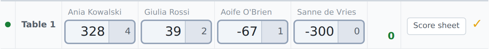<br>
> 📸 **Screenshot — a filled table row: green sum, four seats, TP auto-filled.**

### Status pip colours

| Pip | Meaning |
|---|---|
| ⚪ grey | Row incomplete / not started |
| 🟡 amber | Edited, save pending (debounced) |
| 🟢 green | Saved successfully |
| 🔴 red | Save failed (e.g. network error, or the round is locked) |

### Live collaboration

Multiple scorers can work the same round at once. Edits made by another scorer
appear in your grid within a second (rows you are *actively* editing are not
overwritten for a few seconds, so you won't lose your in-progress typing). If
two scorers do save conflicting numbers for the same table, the save that
arrives second is refused and that scorer's row snaps back to what was actually
stored, with a message — no edit is ever lost silently.

### Finding a table

A **Filter by table** box sits between the publish bar and the grid. Type a
table number to show only that table (exact match); clear it to show every
table again. The value is shared across round tabs, so the filter sticks when
you switch rounds.

- Press <kbd>/</kbd> anywhere on the page — even from a score input — to jump
  straight to the filter; it selects its contents so your next keystrokes
  overwrite it.
- **Tab** runs filter → first seat → … → last seat and then loops back to the
  filter (skipping rows hidden by the filter), so you can enter table after
  table from the keyboard alone.

## 5. The per-table score sheet *(MCR only)*

For MCR events each table also has a detailed **score sheet** covering the **16
hands** played at that table. Click the **Score sheet** button on a table row to
open it in a modal.

> 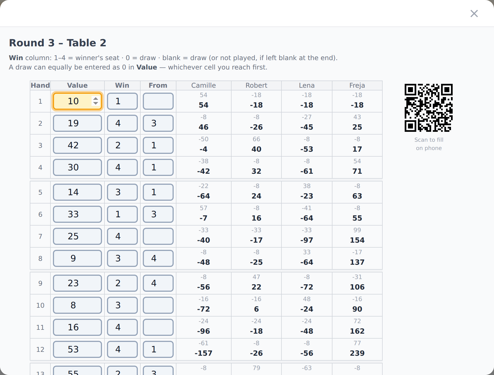<br>
> 📸 **Screenshot — score sheet modal for one table (16 hands).**

For each hand you enter three numbers:

| Field | Meaning |
|---|---|
| **Value** | The hand's point value (the winning hand's points, ≥ 8) |
| **Win** | The **seat** that won the hand (1 = East … 4 = North), or `0` for a drawn hand |
| **From** | The seat that **discarded** the winning tile (blank or `0` for a self-draw) |

As you type, the sheet **computes the resulting score for each player** and the
**running totals**, and shows the derived **per-player total (MP)** and **Table
Points (TP)** at the bottom. These computed totals are compared with the MP/TP
you entered on the main Scoring grid:

- **Green** cell = the score sheet agrees with the entered total. ✅
- **Red** cell = mismatch — re-check either the hands or the table totals. ❗

This is the cross-check that catches data-entry mistakes: a correctly entered
score sheet should produce green totals that match the grid.

### Penalties

Just above the **Total** row the sheet has a **Penalties** row — one integer box
per player. Enter a penalty as a whole number, positive or negative (e.g.
`-10`). The **Total** row then shows each player's hand total **plus** their
penalty, and the **Table Points** are ranked on that **after-penalty** total —
so the sheet's totals line up with the (penalised) MP/TP entered on the grid.

Penalties live on the score sheet only: they also surface on the public
per-table detail view, but they **never change the player's official MP/TP** —
those stay exactly as entered on the Scoring grid.

### Validating a sheet

The **Valid** checkbox (bottom-left of the sheet) marks the table as **checked
and confirmed**. When ticked, the 16 hand inputs are **locked** (greyed out) so
a validated sheet can't be edited by accident — untick to edit again.

Validation state is reflected by the **✓ badge** on the table row in the
Scoring grid:

| Badge | Meaning |
|---|---|
| grey ✓ | No hand data yet |
| 🟡 amber ✓ | Hands entered, **not yet validated** ("in progress") |
| 🟢 green ✓ | Sheet **validated** |

> Score sheets save per-hand automatically (~1 second after each edit) using an
> optimistic version lock: if two people edit the same hand at once, the second
> save is rejected so no edit is silently lost.

### Confidence tint (from scanning)

Hands filled by the **scan** tool (below) start tinted **pink** in proportion to
how *uncertain* the OCR was about that cell. Editing a tinted cell — or simply
confirming it — clears the tint, so you can quickly eyeball which scanned
numbers need a human check.

> 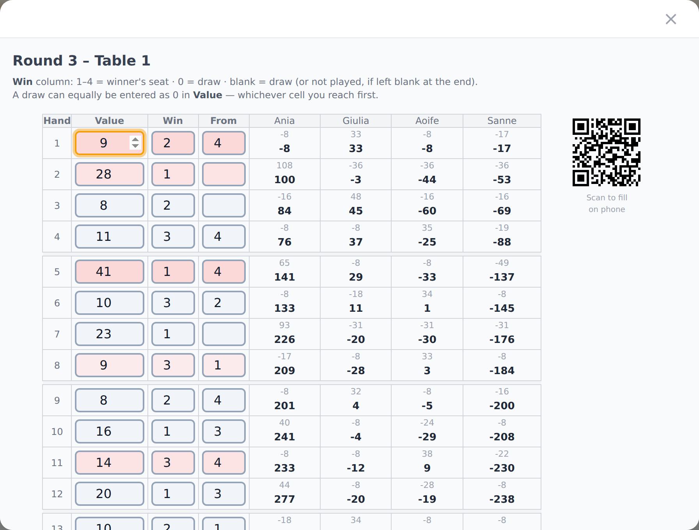<br>
> 📸 **Screenshot — a scanned score sheet with low-confidence pink cells.**

## 6. Scanning a paper score sheet 📷 *(MCR only)*

Tables hand in **paper** A4 score sheets. Instead of typing all 16 hands, the
sheet can be photographed and read by OCR.

### Scanning is optional

You do not have to set this up. Scorers can enter every score sheet by hand, and
that is what the app does by default. Scanning only saves typing. Nothing else in
the app depends on it.

### Setting it up first (tenant admin) ⚙️

Scanning is **off until you set it up**. It needs two things: an API key and a
picture of your score sheet. Both are under **Setup → Scanning**. Set them up
the day before the event, not at the venue.

1. **An API key.** Reading photos is a paid service, billed to your own account.
   Create a key on your
   [Anthropic API keys page](https://platform.claude.com/settings/keys) and paste
   it in. One photo costs about a cent, so a 16-table, 9-round tournament is
   roughly $2. Press **Test key**. That check is free and tells you straight away
   whether the key works.
   - Use a separate key for this, with a spend limit set in the Anthropic
     console. The scan page needs no login, so anyone with the link can spend the
     key. A separate key can be deleted after the event.
   - A new API account starts on the lowest rate limit. A busy end of round is a
     bad time to find that out, so test before the event.
   - Until both the key and the sheet are set, the QR code is hidden on score
     sheets and `/scan` asks players to enter scores by hand.
2. **Your score sheet.** Every photo is matched against a picture of your blank
   sheet. Upload a flat scan of the sheet your tables use, then drag a box around
   the score columns. There is no default sheet. If the app guessed one, every
   photo would fail to match and players would be asked to take the photo again.
   - **What the box must contain:** all 16 hands, in three columns. Your sheet
     can be laid out differently from the example, but the columns have to mean
     this:
     - **Value**: the points for the hand. If nobody won the hand, leave it
       blank, or put a `0` in the Winner column.
     - **Winner**: the winner's seat at the table, 1 to 4. Not a name, not a wind
       letter, and not the player number from the draw.
     - **Discarder**: who discarded, also as a seat 1 to 4. On a self-draw, leave
       it blank, or repeat the winner's number. Both are read as a self-draw, so
       use whichever your tables already use.
     - Anything the reader cannot make out is left as an empty cell for a scorer
       to fill in. One unreadable digit does not stop the rest of the sheet.
   - If you do not have a sheet, the page links to an example you can print.
   - **Leave a small margin** around the score columns. Handwriting often goes
     outside the ruled cells, and the matching is a few pixels off, so a tight
     box can cut the edge of a digit.
3. **Test it.** Photograph a filled-in sheet the way a player would, then:
   - **Test alignment** shows you the exact strip the reader sees. It is free,
     because no sheet is read. Use it until the box is right.
   - **Test scan** does a real read, billed to your key, about a cent. This is
     the only check that tests everything. The strip can look correct and still
     be read wrong if your columns do not match. Do this once before the event.

   Neither of them writes to a score sheet.

If scans start failing during the event, come back to this page. The last
problem is shown at the top: a rejected key, a rate limit, or photos that do not
match the sheet.

**Getting to the scan page:**

- **Easiest:** a table's **Score sheet** shows a **QR code** ("Scan to fill on
  phone"). Scan it with a phone to open the scan page already filled in with
  that round & table.
- **Or** go directly to `https://<tenant>.<your-domain>/scan`.

The scan page needs **no login** — anyone can scan an *empty* table, so players
can photograph their own table's sheet. Only a **scorer** can validate the
result, and a scan can never touch a table that already has data.

> 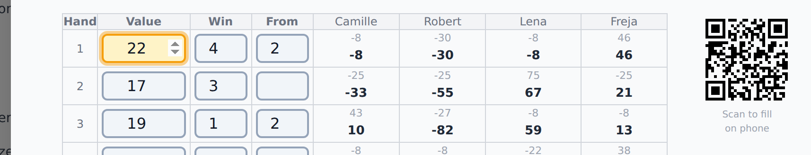<br>
> 📸 **Screenshot — QR code on the score-sheet header.**

**Using the scan page (on a phone):**

> 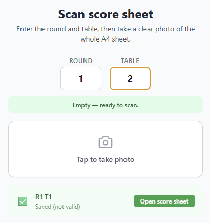<br>
> 📸 **Screenshot — the mobile scan page.**

1. Enter (or confirm) the **Round** and **Table**. The page shows a status
   badge for that table:
   - 🟢 **Empty — ready to scan.**
   - 🔵 **Already has data — locked.** A scan **never overwrites** an entered
     table; correct it on the score sheet instead (or clear the sheet there to
     re-scan).
2. Tap **Take photo** and shoot the **whole sheet**, flat and well-lit.
3. The photo is matched to this tournament's score sheet and read by OCR. This
   runs on the server, and the page waits until it is done, usually a few
   seconds.
4. On success you get a green result card with **Open score sheet** — tap it to
   review the filled-in hands. Scanned data is saved **but left _not_
   validated**, and low-confidence cells are tinted pink so a scorer can verify
   them.
5. The Table field clears (Round is kept) so you can shoot the next table.

> Notes:
> - Scanning **does not auto-validate** — a scorer still opens the sheet, checks
>   the pink cells, and ticks **Valid**.
> - The page handles being offline / a lapsed session gracefully and tells you
>   what to do (reconnect, or reload & sign in again).
> - "Could not match this photo to the score sheet" usually means a bad photo.
>   If *every* photo says it, check the score sheet setup instead. See the setup
>   section above.

## 7. What scorers cannot do

- **Publish rounds.** The *Publish round N* checkbox on each round is
  **disabled** for scorers and labelled *"— staff or publisher only"*. See
  [Part III](#part-iii-publisher).
- **Edit a published round.** Once a round is published its score inputs are
  **locked** (greyed, "unpublish to edit scores"). A publisher must unpublish it
  first. Attempting to save a locked round fails with a red pip and the row
  reverts to the published values.
- **Set up the tournament, manage screens, run the ceremony, or export the EMA
  report** — those belong to the other parts of this guide.

---

# Part III: Publisher

*Deciding when each round becomes official — visible on the public website and
the leaderboard screens. Publishing is deliberately a separate role from
scoring: scorers keep correcting numbers privately, and only a publisher flips
a round to "public".*

## 8. The publish bar

Publishers work on the same **Scoring** page as scorers (one tab per round). At
the top of each round's pane is a **publish bar**:

> 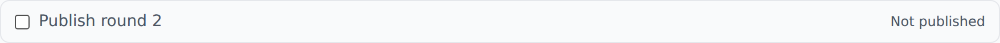<br>
> 📸 **Screenshot — publish bar on a round (toggle, status, hints).**

- **Publish round N** — the checkbox that publishes/unpublishes the round.
- **Status** — *Published* (green) or *Not published*, on the right.
- Hints appear contextually: *"unpublish to edit scores"* when a round is
  locked, and a special note on the **last round** (below).

> A publisher can also edit scores: whoever may lock a round's numbers may
> correct them too, so there is no need to grant Scorer alongside Publisher.

## 9. Publishing and unpublishing

Tick **Publish round N**. The console enforces these rules (the same checks run
on the server, so they can't be bypassed):

1. **The round must be complete.** Every seat at every table in the round must
   have its scores filled (on MCR, both Minipoints and Table Points). If any
   are missing, the toggle stays disabled until the round is finished.
2. **Rounds publish in order.** You can't publish round N until rounds 1…N-1
   are already published — no gaps.

On success:

- The round's scores become **locked** — score inputs in that round's grid turn
  grey/read-only. Scorers can no longer edit it. (This is the safety property:
  publishing freezes the official numbers.)
- The **public leaderboard updates** and all display screens refresh to show
  the newly official standings.

> 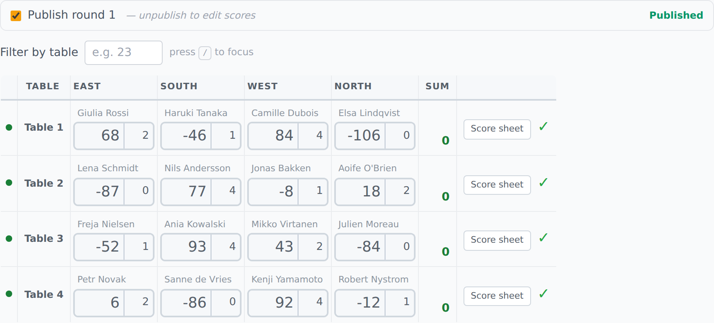<br>
> 📸 **Screenshot — a published (locked) round: green "Published", grey inputs.**

To correct a score after publishing, **untick Publish round N**. Because rounds
must stay gap-free, **unpublishing a round also unpublishes every round after
it** — if rounds 1–5 are published and you unpublish round 3, rounds 3, 4 and 5
all become unpublished (and editable again). Re-publish when corrected.

**Publish state is shared live**: if another publisher (or you, on another
device) publishes a round, every scorer's grid updates its toggles, status
labels and lock state within a second.

## 10. The last round is special (podium suspense)

Publishing the **final round** does **not** reveal the final standings to the
public. Instead it publishes the round with the result **hidden**, preserving
suspense for the prize-giving. The publish bar reminds you of this on the last
round.

So the end-of-event flow is:

1. **Publisher:** publish the final round normally (standings stay hidden).
2. **Display operator:** run the **Ceremony console**
   (see [§13](#13-the-prize-giving-ceremony)) to reveal teams/players place by
   place, and finally press **Publish to everyone & end** — *that* is what
   makes the complete final results public.

> 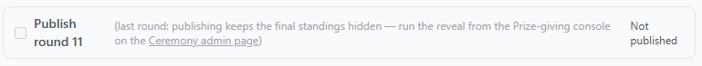<br>
> 📸 **Screenshot — last-round publish bar with the ceremony hint.**

## 11. Publisher overview

Alongside the per-round publish bars, publishers (and admins) get a dedicated
**Publisher overview** page in the sidebar. It gives a bird's-eye view of the
whole tournament — **one row per round** — so you can see how far each round
has progressed and publish without hunting through the round tabs:

> 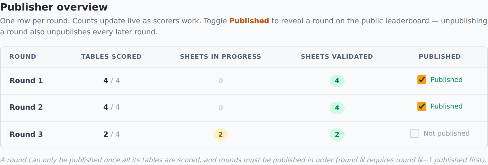<br>
> 📸 **Screenshot — Publisher overview: one row per round with progress counts and a Published toggle.**

| Column | Meaning |
|---|---|
| **Tables scored** | Tables whose four seats all have Minipoints entered, shown as `scored / total`. |
| **Sheets in progress** | Tables whose score sheet has been started but not yet validated *(MCR only)*. |
| **Sheets validated** | Tables whose score sheet has been validated *(MCR only)*. |
| **Published** | A checkbox to publish / unpublish the round. |

The **Published** checkbox obeys the same rules as the publish bar, so an
incomplete or out-of-order round's checkbox stays disabled. **Unpublishing pops
up a big warning** spelling out exactly which rounds will be reopened.
Everything on this page updates live as scorers work.

---

# Part IV: Display operator

*Everything the audience sees on the room's projectors / TV screens: which view
each screen shows, the round timer (with its synchronized start gong), the
display settings, and the prize-giving ceremony.*

## 12. Driving the screens

### Screens, explained

Each physical screen in the room runs a browser pointed at a numbered URL:

```
https://<tenant>.<your-domain>/1     ← screen 1
https://<tenant>.<your-domain>/2     ← screen 2
...
```

A **screen** record in the app maps each URL to a **view** (what to show). Add
as many screen records as you have physical displays, point each display's
browser at the matching `/<n>` URL, and then change views centrally from the
console — every screen reacts live.

**Available views:**

| View | Shows |
|---|---|
| **Blank** | Black screen (off) |
| **Welcome** | Title/welcome slide (tournament logo + name) |
| **Counter** | The **round timer** + a condensed standings strip |
| **Announcement** | The announcement message (set in Display settings) |
| **Schedule** | The tournament schedule |
| **Standings — detailed** | The leaderboard with per-round columns |
| **Standings — totals** | Compact totals-only leaderboard |
| **Standings — teams** | Team standings *(team events)* |

Standings views are **paginated**: next to the view, each screen card has a
**Pages** selector — pin one page to that screen, or let the pages **rotate**
automatically (the rotation interval is a display setting).

### The Display on screens page

Open **Display on screens** from the sidebar.

> 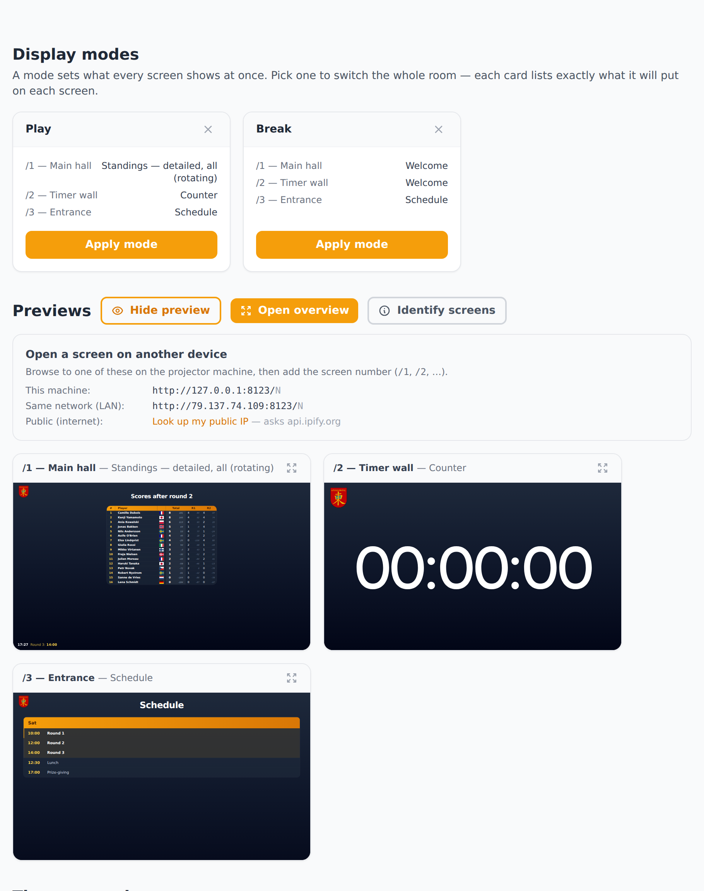<br>
> 📸 **Screenshot — Display on screens page (screen cards + settings).**

- **Add screen** appends a new screen (it starts on *Blank*); **Remove screen**
  removes the last one. Add one per physical display and open each display's
  browser at its `/<n>` URL (shown on the screen card as a clickable link).
- Each **screen card** is headed `/N — name`: click the name to rename the
  screen (e.g. "Main hall left"), so cards are identifiable at a glance.
- **Identify screens** flashes each screen's number in its corner for a few
  seconds — match physical projectors to their URLs without walking over.
- Each card's **Output** dropdown changes what that physical screen shows
  **immediately**; the **Pages** dropdown pins or rotates the standings pages.
- The **All screens** card at the top sets every screen to one view in a single
  click.

> 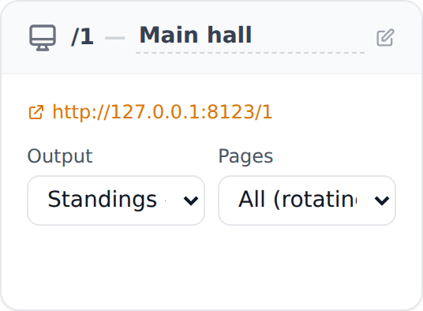<br>
> 📸 **Screenshot — a screen card: URL link + output/pages dropdowns.**

**Display modes (saved presets):** a **display mode** is a saved snapshot of
*all* screens' current views, so you can flip the whole room between layouts in
one click. Type a name and **Save mode** to capture the room; saved modes
appear as amber tiles — click a tile to apply, click its **✕** to delete.

> 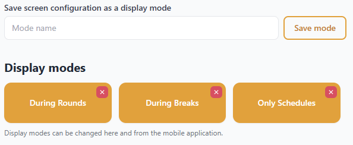<br>
> 📸 **Screenshot — saved display-mode tiles.**

**Screen previews:** click **Show preview** to load live thumbnails of every
screen, so you can confirm what's actually on each projector without walking
over to it. Click a thumbnail's **enlarge** icon for full size. Previews only
load while shown (to save bandwidth).

> 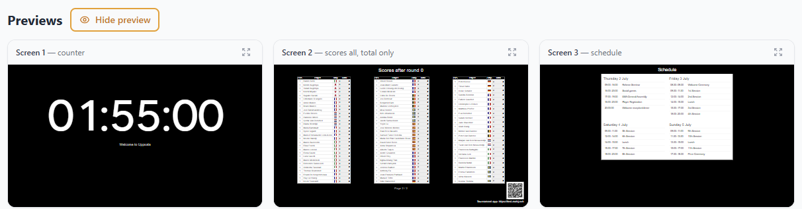<br>
> 📸 **Screenshot — the screen previews row.**

### Round timer control

The **Timer control** panel runs the per-round countdown shown on any screen
set to the **Counter** view.

> 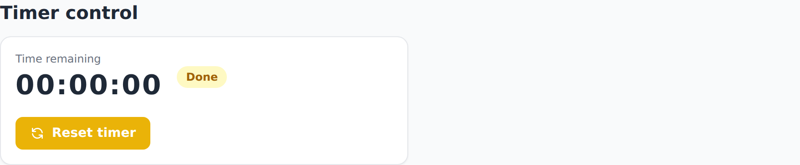<br>
> 📸 **Screenshot — Timer control panel (Start / Running / Reset).**

- **Start timer** — starts the round. There's a brief lead-in and a **3-2-1
  countdown with a start gong** that fires in lockstep on **every** screen, so
  all rooms begin together.
- While running, the panel shows the **time remaining** and a *Running* badge;
  the button becomes **Reset timer**. When time is up the badge reads *Done*.
- Resetting a running timer asks for confirmation.

The timer is **server-authoritative** — the server owns the official start
instant and every screen renders from it, so screens can't drift apart or be
reset by a stray reload. The round length is the **Total time of a round**
tournament setting (a tournament admin sets it, see
[§15](#15-tournament-settings)).

### Display settings

The **Display settings** panel holds presentation values. Each field saves on
change and pushes to the screens live.

> 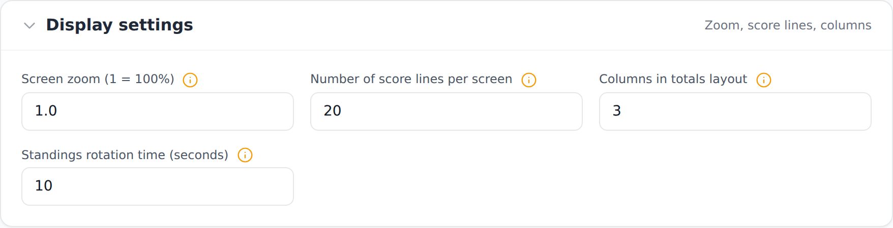<br>
> 📸 **Screenshot — Display settings.**

| Setting | Effect |
|---|---|
| **Screen zoom** (1 = 100%) | Scales the on-screen content up/down to fit your displays |
| **Score lines per screen** | How many leaderboard rows fit on one standings page (drives pagination) |
| **Columns (totals view)** | How many columns the totals-only standings layout uses |
| **Announcement message** | The text shown by the **Announcement** view (and under the timer) |
| **Page rotation time (seconds)** | How long each page shows before a rotating standings screen flips to the next |

## 13. The prize-giving ceremony

The **Ceremony console** takes over **all** display screens with a full-screen
reveal sequence for the awards, while the **public website stays in suspense**
until you publish at the very end.

Open **Ceremony console** from the sidebar.

> 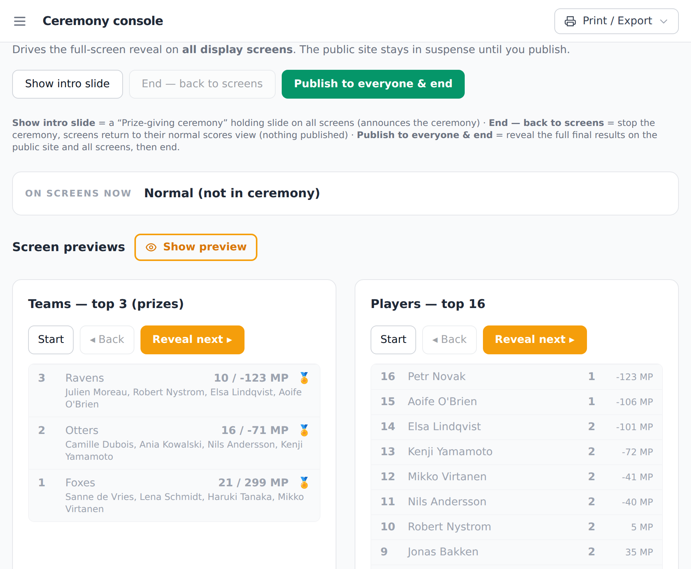<br>
> 📸 **Screenshot — Ceremony console (Teams / Players / Stats panels).**

### Layout

**Top-right buttons** (apply to the whole ceremony):

| Button | Effect |
|---|---|
| **Show intro slide** | A "Prize-giving ceremony" holding slide (logo + title) on every screen |
| **End — back to screens** | Stop the ceremony; screens return to their normal views. **Nothing is published.** |
| **Publish to everyone & end** | Reveal the **full final results** on the public site and all screens, then end. **Do this once, at the very end.** |

The rest of the console:

- **On screens now** — a live status line telling you what the audience
  currently sees.
- **Screen previews** — same live previews as the Display page, so you can
  watch the reveal land.
- Three result panels: **Teams (top 3)**, **Players (top N)**, and **Stat
  highlights**.

### Teams and Players panels

Each has the same controls:

- **Start** — put that section on the screens, empty and ready.
- **Reveal next ▸** — reveal the next place (lowest rank first, working up to
  1st). Press once per place.
- **◂ Back** — undo the last reveal.

A yellow **"Next to announce"** line always previews the upcoming place, name,
and score — read it to the announcer *before* you press *Reveal next*. The full
list is shown below for reference, greying out places not yet revealed.

- **Teams** shows only the **top 3** (the prize-winners), each with team name,
  all member names, and the team total (TP / MP) — no individual player scores.
- **Players** shows the **top N** (typically 16), each with Table Points
  (large) and Minipoints (small).

> The Teams panel only appears if the tournament uses teams.

### Stat highlights

Click any **stat card** (e.g. *Highest score in a round*, *Biggest hand*, *Most
wins*) to show it big on the screens. You can show any number of them, in any
order, or skip them entirely.

### Typical run-through

1. **Show intro slide** while people gather.
2. **Teams → Start**, then **Reveal next** ×3 (3rd → 1st). Hand out team prizes.
3. **Players → Start**, then **Reveal next** until 1st.
4. Optionally show a few **Stat highlights**.
5. **Publish to everyone & end** — results are now public for everyone.

> The "Publish to everyone & end" step is how the **final standings** become
> public: during play the last round is published with its result hidden for
> suspense, and this reveal is the first time complete results leave the
> building.

### If a screen looks stuck

Each screen recovers on its own after a moment. If one stays blank or stale,
**refresh that screen's browser tab** — it rejoins at the current slide. The
console itself can be reloaded too; it resumes where you left off.

---

# Part V: Tournament admin

*Setting up the tournament and its crew, and closing the event out. An admin
also holds every role above.*

## 14. The two home pages

Each workspace has a home page.

**Setup checklist** (Setup home, and the admin's landing page until play starts)
tracks readiness: players listed, seating chart in place (and sized for the
list), draw complete, screens configured (optional), with a link to the page that
completes each step and to **Print materials**. When the required steps are all
done it offers **Go to Run →**. A failed template import also reports here.

> 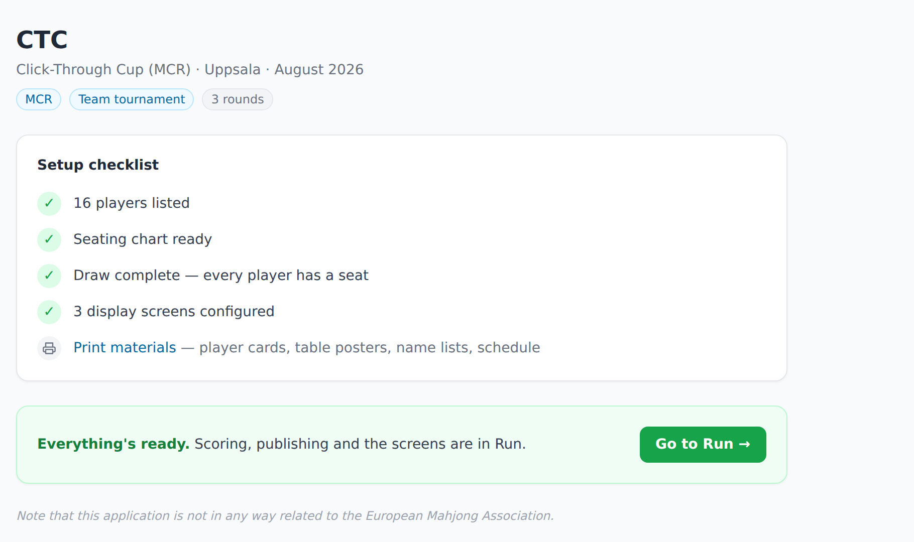<br>
> 📸 **Screenshot — the Setup checklist.**

**Dashboard** (Run home, and the landing page once a round has been scored or
published) shows **Rounds** progress (scored / published), the **round timer**
live, and — when web publishing is configured — the **Publish to web** button.

## 15. Tournament settings

**Setup → Tournament settings** holds the event's identity and format:

- **Identity** — title (short, for screens and browser tabs), full tournament
  name (report headers and printouts), city, period, and the optional **home
  nation** (enables a national sub-ranking) and **federation code** (stamped on
  the EMA report).
- **Format** — the **ruleset** (MCR / Riichi — this is what shows or hides the
  TP column, score sheets and scan tool) and the **teams** toggle (team
  standings, columns and printouts).
- **Rounds** — the **number of rounds** and the **total time of a round** (the
  timer's countdown length, in seconds — e.g. `6900` = 1 h 55 m).
- **Schedule** — the agenda table (day / time / name per row, with a *Round*
  checkbox marking actual playing rounds). Mark exactly *number of rounds* rows
  as rounds so per-round times line up.
- **Tournament logo** — a PNG (max 2 MB) shown on screens and printouts in
  place of the default.
- **Danger zone — Reset tournament** permanently deletes *everything* for this
  tournament (players, seating, scores, published rounds, schedule) and
  restores defaults. It requires typing `RESET`, re-entering your password, and
  a final confirmation. There is no undo.

## 16. User management

**Setup → Administration → User management** is where the crew gets its accounts. The
page re-asks for your password before opening (so a borrowed or unattended
session can't reach it), and shows only **this tournament's** users.

- **Add a user** — username plus their roles. Roles are the checkboxes on each
  row and can be changed at any time: **Admin**, **Scorer**, **Display
  operator**, **Publisher** (see [Roles at a glance](#roles-at-a-glance)). A
  publisher can also score — no need to tick both.
- **Login links** — generate a **passwordless login link** for a user and hand
  it out (a link is valid for a limited number of days and can be invalidated —
  *Invalidate login links* revokes all of a user's outstanding links). Ideal
  for volunteers and kiosk laptops: no password to type or forget.
- **Remove** takes a user's access to *this* tournament away. The console
  refuses to remove or demote the **last admin**, so a tournament can't lock
  itself out.
- A user marked **shared** also belongs to another tournament on this server;
  their credentials are then managed by the platform operator (adding an
  existing account to a new tournament is a platform-operator action).

**Checking what a role sees.** The avatar menu (bottom of the sidebar) has a
**Preview as** section for admins: pick *Scorer*, *Publisher* or *Display operator*
and the whole console — sidebar, pages, permissions — becomes what that account
gets, with a banner on every page and **Back to admin view** to return. Handy
before handing out accounts, and for following this guide's role parts.

Preview is for checking, not for working: it is still your admin session, and
**Back to admin view** is one click away for whoever holds the device. On the
day, every scorer, publisher and display operator gets their own account from
User management and signs in with its login link.

> 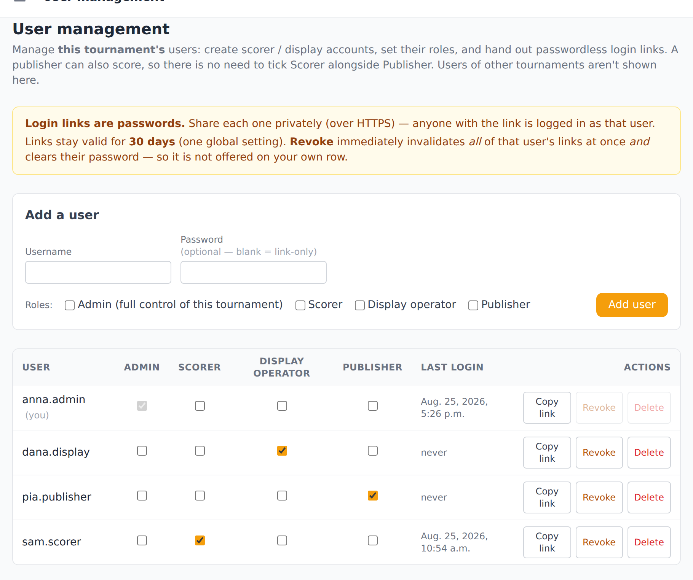<br>
> 📸 **Screenshot — assigning roles.**

## 17. Setting up the tournament

The **Setup** workspace builds the event before play — work down the **Setup
checklist** and it tells you what is still missing.
There are two ways to get the player list in; everything after that is the same.

**A. Entirely in the console (no Excel):**

1. **Tournament settings** — title, ruleset, teams toggle, **number of rounds**
   and the schedule ([§15](#15-tournament-settings)).
2. **Edit players** — click **Edit players** to unlock the table, then
   **Add player** (below the table) once per competitor. Each new row arrives
   named *Player n* (n = its position in the list) with the cursor on its name; type the real
   name, country, EMA id and team over it — each change saves as you leave the
   field. The **×** at the end of a row removes a player. **Done editing**
   warns if the total isn't a multiple of 4 (seating needs full tables) or if
   rows are still named *Player n*.
3. **Seating → Generate** (below).

**B. From the Excel template:**

1. **Excel import / export** — download the blank Excel template (or **export
   the current tournament** in the same format to back it up / edit offline),
   fill it in, and upload. This creates the players, the seating chart for
   every round, the schedule, and the tournament options in one go.
   - ⚠️ Importing **replaces the whole tournament** with what the file holds —
     the console warns you, naming what will be replaced.
   - A wrong or old-format file (missing sheets, unreadable rounds count, a
     player count that isn't a multiple of 4, duplicate draw numbers, an
     unreadable score cell…) is **rejected with the tournament untouched**.
   - **Export current tournament** always writes the setup — settings, players,
     schedule, seating. Once play has started, **Include scores and score
     sheets** (ticked by default) adds three more tabs: *Scores* (what every
     seat recorded — MP, penalty, table points under MCR, and how far its sheet
     got), *Score sheets* (every played hand: winner, discarder, value) and
     *Standings* (the ranked table). Which rounds are published travels with
     them.
   - **The import reads all of that back**, so a workbook restores the
     tournament it came from — scores, hands and published rounds included. A
     file exported *without* the scores loads the setup and leaves empty score
     sheets, and the *Standings* tab is derived: edits there are ignored (the
     tab says so in its first row).
   - Columns are matched by their header rather than their position, and winds
     may be written `E`/`S`/`W`/`N`, `East`…`North` or `1`–`4`, so a workbook
     you have edited by hand still imports.
   - For moving a tournament between installs, [Backup &
     restore](#19-backing-up-and-restoring-a-tournament) is still the exact
     copy — it carries the screens, the timer and everything else Excel has no
     column for.

**Then, either way:**

2. **Seating** — inspect the current seating chart's quality (how well
   opponents are spread), or **generate a seating in the app** instead of
   importing one: preview a chart, compare quality measures, then apply.
   Applying a new seating clears any entered scores.
3. **Edit players** — add or remove players, correct names, EMA ids, countries
   and teams in place, and assign **draw numbers** (which seat-slot each player
   occupies) once seats exist. Add and remove players **before** the seating
   is generated: the chart is built for the list's size, and if the two later
   differ the Dashboard and the Seating page show a red warning until you
   regenerate the seating or fix the list. A player who withdraws
   mid-tournament is *not* removed — their seat has to stay in the chart;
   rename the row (e.g. to the substitute) or leave it as is.
4. **Randomize players (live)** / **Team draw (live)** — full-screen draw pages
   to run the draw *as a show* in front of the players; each opens in its own
   tab.
5. **Print materials** — the paper for the room: player names, team names,
   player cards, table positions, cross positions (also by team), and the
   schedule. See [Printing](#printing). To change the look of the player cards
   (size, colours, theme), see
   [Designing the player cards](#designing-the-player-cards).

> 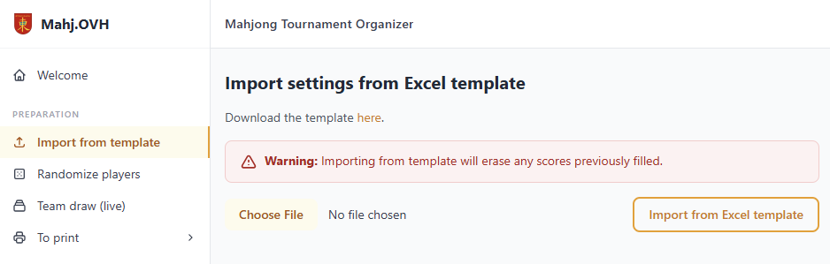<br>
> 📸 **Screenshot — Excel import / export page.**

## 18. Publishing the site to the web

**Setup → Administration → Publish target** configures **static web publishing**: on
every round publish, the public site is rendered to static files and uploaded
(SFTP) to a plain web host — useful when spectators should follow on a separate
public website. Configure host, port, user, remote path and a password *or*
private key; **Test connection** verifies the setup. The same page sets the
**Spectator URL** advertised in QR codes on screens and printed player cards.
Leave the target disabled to not publish. Progress of an upload shows as a
toast in the console shell.

Each publish also uploads a **backup of the whole tournament** next to the site
(see [§19](#19-backing-up-and-restoring-a-tournament)). The **Backup directory**
field says where; leave it blank for a `mahj-backups` folder beside it.
Prefer a directory *outside* the served site — a backup contains every score,
including a withheld final round the public site is still hiding.

## 19. Backing up and restoring a tournament

**Setup → Administration → Backup & restore** deals in **dump files**: one file holding
the entire tournament — settings, the player list, the seating, every entered
score, which rounds are published, the schedule, the screens and the round
timer.

- **Download dump** saves one now. If web publishing is configured, one is also
  uploaded automatically on every publish, so a recent backup is already off-site
  (the 20 most recent are kept). Without a publish target, downloading is the
  only copy — do it after each round.
- **Restore from dump** replaces the current tournament with an uploaded file.
  It asks you to retype the subdomain first, and it cannot be undone. User
  accounts and the publish target are kept as they are.

A dump can be restored into **any** tournament on any install running the same
app version — that is how a tournament moves onto a venue laptop (or back off
it) when the server is unreachable. If the file was made for a different
tenant, the confirm dialog says so before you commit.

> 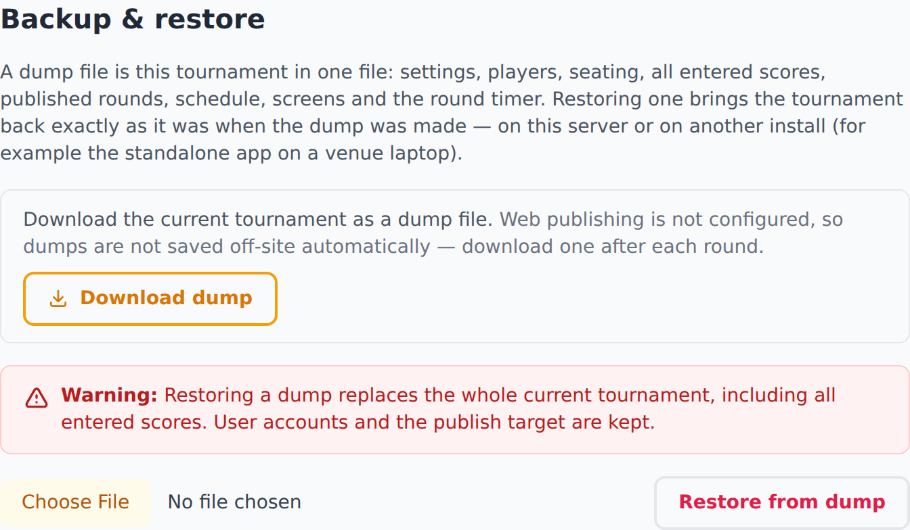<br>
> 📸 **Screenshot — Backup & restore page.**


## 20. After the tournament — EMA export

**Results → Generate EMA report** downloads the ranking-submission workbook
(`EMA_report.xlsx`) once the event is finished and all rounds are published.
The optional **federation code** from the tournament settings is stamped into
it.

---

# Part VI: Platform operator

*The superuser who runs the server — not part of the tournament crew. Their
Setup sidebar shows one extra entry under Administration:*

- **Tenants** — create and manage tournaments (each lives on its own
  subdomain), and jump into any tenant's user management.

The raw Django admin (`/admin_db/`, superuser only) is deliberately **not
linked** from the console: everything a tournament needs is editable from the
pages above, and the raw admin lists every tournament's data unscoped. It is a
rescue tool — type the URL when you need it.

Setting up the server itself — Docker, DNS/TLS, environment variables, backups,
the standalone venue-laptop build — is documented in
[`docs/hosting/`](../hosting/deployment.md).

---

# Appendices

## 21. Permissions recap

| Action | Scorer | Publisher | Display op | Admin |
|---|:--:|:--:|:--:|:--:|
| Enter / edit scores & score sheets | ✅ |  |  | ✅ |
| Scan paper score sheets | ✅ | *(anyone can scan an empty table)* | | ✅ |
| Publish / unpublish rounds |  | ✅ |  | ✅ |
| Manage screens, timer, display settings |  |  | ✅ | ✅ |
| Run the ceremony / final "publish to everyone" |  |  | ✅ | ✅ |
| Setup (settings, import, seating, players, printing) |  |  |  | ✅ |
| User management, web publishing, EMA export |  |  |  | ✅ |

(Roles combine: a user holding several roles has the union of these. The
platform operator can do all of this on every tournament.)

## 22. Rehearsing on a test tournament

A **test tournament** is a throwaway tournament for rehearsing the whole system —
training scorers, checking how the leaderboard/screens look with data, and
practising the prize-giving ceremony — **without touching a real event**. Any
tenant (including a standalone install) becomes one by ticking **This is a test
tournament** on **Tournament settings**; on a multi-tenant host the convention
is a dedicated tenant such as:

```
https://test.<your-domain>/
```

While the box is ticked a small amber **TEST** badge sits next to the site name
in the admin sidebar, on every page, so a flag left on by mistake is obvious.
The only functional differences from a real tournament are a **fake-data
toolbar** on the Scoring page that can fill or clear scores with
random-but-valid results, and an **Add random players** button on Edit players.
Everything else (screens, ceremony, publishing, printing) behaves exactly like
production, so it's a faithful rehearsal.

### Seed players & schedule first

The fake-data buttons fill **scores** for the players and tables that already
exist — they do **not** create players. So first set up a tournament structure,
exactly like a real event: sign in as an **admin** and either build a roster on
Edit players and generate a **Seating**, or run **Excel import / export** (see
[§17](#17-setting-up-the-tournament)). On a test tournament, Edit players gains a
**🧪 Add 4 random players** button next to **+ Add player**: each click appends
four made-up competitors with names, a fake EMA number (always starting `99`, so
it can never be mistaken for a real one), a country and — if *Team tournament*
is on — a team, four to a team. They are not drawn in; use the normal draw flow.
Importing or re-generating the seating wipes any previous scores on the tenant —
which is exactly what you want here.

### The fake-data toolbar 🧪

On a test tournament, the **Scoring** page shows an extra dashed amber toolbar
at the top (it is rendered **only** while the settings box is ticked):

> 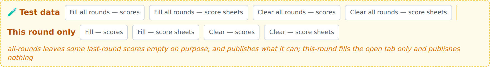<br>
> 📸 **Screenshot — the "🧪 Test data" toolbar above the round tabs.**

| Button | What it does |
|---|---|
| **Fill all rounds — scores** | Fills every table in **every round** with random Minipoints that sum to zero, auto-computes Table Points, and saves. If you're a publisher/admin it then **publishes rounds in order** too. |
| **Fill all rounds — score sheets** | Generates a full 16-hand **score sheet** for every table in every round and marks each as **validated**. |
| **Clear all rounds — scores** / **— score sheets** | The reverse (unpublishing first if needed). |
| **This round only: Fill / Clear …** | The same four actions scoped to the **open round tab** and publishing nothing — for stepping a tournament forward one round at a time and watching the badges, publish gates and displays react. |

> The all-rounds fill leaves the **last two tables of the final round blank** on
> purpose, so you can exercise the *incomplete-round / can't-publish* path and
> the podium-suspense flow.

**What "scores" vs "score sheets" means:** *scores* are the per-seat MP/TP
totals on the Scoring grid (what the leaderboard uses); *score sheets* are the
detailed 16 hands behind each table (MCR only). For a quick
leaderboard/ceremony rehearsal you usually only need **Fill all rounds —
scores**.

### Rehearsing each part of the system

Once the test tournament has data you can exercise the full operator workflow:

1. **Leaderboard / public site** — open `https://test.<your-domain>/` to see
   standings, seating and stats render with the fake data.
2. **Screens** — as a display operator ([§12](#12-driving-the-screens)): add a
   screen, open `https://test.<your-domain>/1`, and try each view. Practise the
   **timer** and **display modes**.
3. **Publishing** — as a publisher ([§9](#9-publishing-and-unpublishing)):
   publish/unpublish rounds, see the lock behaviour and the cascade on
   unpublish.
4. **Ceremony** — as a display operator: run the **Ceremony console**
   ([§13](#13-the-prize-giving-ceremony)) end to end. The deliberately
   incomplete last round lets you practise the suspense → reveal flow.
5. **Scanning** — open a score sheet, try the **QR → scan** path on a phone
   (requires the OCR service to be configured on the host).

**Reset between rehearsals:** *Clear all rounds* wipes results but keeps the
players/seating; re-running the **Excel import / export** upload resets the whole tenant.

### Notes & caveats

- The toolbar and the random-players button are gated on the **This is a test
  tournament** setting, and the server refuses random players when it is off.
  Untick it before a real event — the sidebar **TEST** badge is your reminder.
- Random fills produce **valid** tables (each table's Minipoints sum to zero)
  so the leaderboard maths and the score-sheet cross-checks behave like the
  real thing.
- You still need the appropriate **role** for each action on a test tournament —
  which also makes it a good place to confirm a new user's roles before the
  real event.

## 23. Quick reference

| Task | Where | Role |
|---|---|---|
| Create users / roles / login links | Setup → Administration → **User management** | Admin |
| Set title, rules, rounds, schedule, logo | Setup → **Tournament settings** | Admin |
| Set up the tournament | Setup → **Edit players** → Add player, then **Seating** → generate (or **Excel import / export**) | Admin |
| Add / remove / correct a player, assign draw numbers | Setup → **Edit players** | Admin |
| Print player cards / positions / schedule | Setup → **Print materials** | Admin |
| Change the player cards' size, colours or theme | Setup → **Player card design** | Admin |
| Print the current standings | Run → Results → **Print scores** | Scorer |
| Enter table MP | Scoring page → seat inputs (auto-saves) | Scorer |
| Enter all 16 hands *(MCR)* | Scoring row → **Score sheet** | Scorer |
| Confirm a table *(MCR)* | Score sheet → **Valid** checkbox | Scorer |
| Read a paper sheet *(MCR)* | **Score sheet → QR**, or `/scan` on a phone | anyone (validation: Scorer) |
| Make round N official | Publish bar or **Publisher overview** (round complete; 1…N-1 published) | Publisher |
| Reopen a round for edits | Untick **Publish round N** (also reopens N+1…) | Publisher |
| Fix a published round's score | Ask a publisher to unpublish it first | Publisher + Scorer |
| Final round | Publish it (stays hidden) → finish via Ceremony console | Publisher + Display op |
| Add a projector | Display page → **Add screen**, open `/<n>` on that machine | Display op |
| Change what a screen shows | Screen card → **Output** dropdown | Display op |
| Flip the whole room at once | Save a **display mode**, click its tile | Display op |
| Start the round (with gong) | Timer control → **Start timer** | Display op |
| Run the awards | **Ceremony console** | Display op |
| Make final results public | Ceremony console → **Publish to everyone & end** | Display op |
| Publish the site to a web host | Setup → Administration → **Publish target** | Admin |
| Back up / restore the tournament | Setup → Administration → **Backup & restore** | Admin |
| Generate the ranking export | Run → Results → **Generate EMA report** | Admin |
| Rehearse with fake data | `test.<your-domain>` → Scoring → **Fill all rounds** | any (see §22) |
